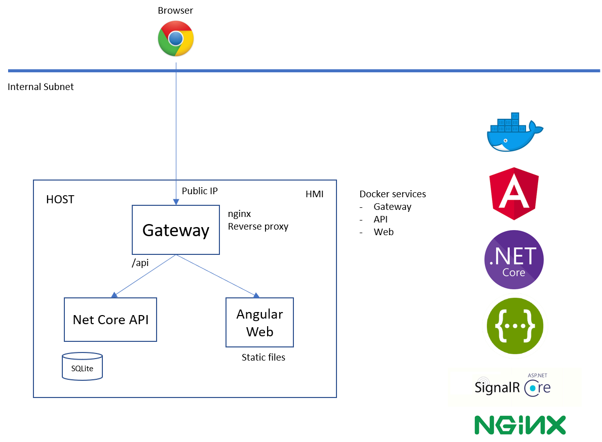

# About StarterKitAngularAndDotnetApi

<!-- ALL-CONTRIBUTORS-BADGE:START - Do not remove or modify this section -->
[](#contributors)
<!-- ALL-CONTRIBUTORS-BADGE:END -->

## **Introduction**

This is a demo project which can be used as a quickstart in the technologies used or simply as a repository of code snippets that can be copy&pasted into another project.

The main stack of technologies that you will find in this project is:

- .NET 6
- Angular 11
- SQLite
- nginx as reverse-proxy gateway

## **Architecture diagram**



## **Project features**

### **Frontend**

1. Angular Material Theme
    - Customizable fonts and colors with variables that can be reused throughout all the UI
2. UI client API generator
    - It uses the [OpenAPI](https://swagger.io/specification/) specification from the API to generate a full featured client with all the Typescript typings, ready to be used. Based on the tool [openapi-generator](https://github.com/OpenAPITools/openapi-generator)
    - It’s implemented as an Angular client but the same generator can be used for other frameworks or even for just for the typings and be used for any framework (Angular, React, Vue,...)
3. Push notifications
    - Socket client via SignalR
4. UI integrated with Docker
    - With hot reloading for development
5. Multilanguage with ngx-translate
6. Angular folder structure based on “shared”, “core”, “feature modules”, “pages” and “components”
7. Authentication
    - Based on token cookie and Authorization header token
    - Keep alive process to refresh token
    - Change password feature
    - The UI autologs-in with a user called "Operator". There is no concept implemented of showing a starting login page (which is the most common scenario in a webapp)
8. Authorization
    - Based on Roles. Each user has a role assigned and the UI might restrict access based on that.
9. Generic application form input
   - Reusable input for all the application (text, numeric, date,...)
   - Common style and validations
   - Valid only for Reactive Forms

### **Backend**

1. .Net core API Authentication Integrated
    - Implemented with SQLite database with users with login and password with Entity Framework
    - Generates an HTTP Only Cookie Token and another Token that must be sent in each request
    - The token per request expires after some time and must be "refreshed" by a keep-alive in the UI
2. API with Swashbuckle to generate the OpenAPI specification and Swagger UI.
3. Entity Framework with SQLite
    - Used to store users and languages as an example
4. Unit tests with xUnit
    - Mock with SQLite Inmemory Database or real local database
5. Authorization based on roles

### **Gateway**

Nginx configuration as a reverse-proxy gateway (as a separate docker service)

- Avoids CORS issues
- Exposes Frontend and Backend API from a single endpoint service
- Queries are redirected to the WebApp or API based on the url path.
- It can be used as a single point for HTTPS communication (not implemented)

## **Getting Started**

### **Installation**

You just need to install [Docker](https://www.docker.com/)

### **Start project**

Run the command:

```sh
docker-compose -f docker-compose.yml -f docker-compose.dev.yml up --build
```

After running the command you can open your browser and see the WebApp:

<http://localhost>

Also you can open the API Swagger UI in:

<http://localhost:8080/swagger/index.html>

## **Development**

### **Frontend**

You will need to install libraries locally:

```sh
npm install
```

The Docker command has Hot Reloading so you can start modifying files and they will be visible in the UI.

#### **Generate API Client**

After copying the new version of the API into this file:

src\app\core\api\api.json

You can regenerate the client like this:

```sh
npm run generate:api
```

#### **Generate resources**

Resource keys are autogenerated from the code with some 'markers'. After doing your changes in code run command

```sh
npm run generate:i18n
```

### **Backend**

Open the API solution with Visual Studio 2022 minimum.
The backend does not have "watch mode" so every time is modified the docker command must be re-run.

## Contributing

Please see our [Contribution Guide](CONTRIBUTING.md) to learn how to contribute.

## License


(LICENSE) © 2022 [ERNI - Swiss Software Engineering](https://www.betterask.erni)

## Code of conduct

Please see our [Code of Conduct](CODE_OF_CONDUCT.md)

## Stats


## Follow us

[](https://www.twitter.com/ERNI)
[](https://www.twitch.tv/erni_academy)
[](https://www.youtube.com/channel/UCkdDcxjml85-Ydn7Dc577WQ)
[](https://www.linkedin.com/company/erni)

## Contact

Erni_Services  - [@ERNI](https://twitter.com/ERNI) - esp-services@betterask.erni

## Contributors ✨

Thanks goes to these wonderful people ([emoji key](https://allcontributors.org/docs/en/emoji-key)):

<!-- ALL-CONTRIBUTORS-LIST:START - Do not remove or modify this section -->
<!-- prettier-ignore-start -->
<!-- markdownlint-disable -->
<table>
  <tr>
    <td align="center"><a href="https://github.com/davidwalker2235"><br /><sub><b>davidwalker2235</b></sub></a><br /><a href="https://github.com/ERNI-Academy/starterkit-angular-and-dotnet-api/commits?author=davidwalker2235" title="Code">💻</a> <a href="#content-davidwalker2235" title="Content">🖋</a> <a href="https://github.com/ERNI-Academy/starterkit-angular-and-dotnet-api/commits?author=davidwalker2235" title="Documentation">📖</a> <a href="#design-davidwalker2235" title="Design">🎨</a> <a href="#ideas-davidwalker2235" title="Ideas, Planning, & Feedback">🤔</a> <a href="#maintenance-davidwalker2235" title="Maintenance">🚧</a> <a href="https://github.com/ERNI-Academy/starterkit-angular-and-dotnet-api/commits?author=davidwalker2235" title="Tests">⚠️</a> <a href="#example-davidwalker2235" title="Examples">💡</a> <a href="https://github.com/ERNI-Academy/starterkit-angular-and-dotnet-api/pulls?q=is%3Apr+reviewed-by%3Adavidwalker2235" title="Reviewed Pull Requests">👀</a></td>
    <td align="center"><a href="https://github.com/Rabosa616"><br /><sub><b>Rabosa616</b></sub></a><br /><a href="https://github.com/ERNI-Academy/starterkit-angular-and-dotnet-api/commits?author=Rabosa616" title="Code">💻</a> <a href="#content-Rabosa616" title="Content">🖋</a> <a href="https://github.com/ERNI-Academy/starterkit-angular-and-dotnet-api/commits?author=Rabosa616" title="Documentation">📖</a> <a href="#design-Rabosa616" title="Design">🎨</a> <a href="#ideas-Rabosa616" title="Ideas, Planning, & Feedback">🤔</a> <a href="#maintenance-Rabosa616" title="Maintenance">🚧</a> <a href="https://github.com/ERNI-Academy/starterkit-angular-and-dotnet-api/commits?author=Rabosa616" title="Tests">⚠️</a> <a href="#example-Rabosa616" title="Examples">💡</a> <a href="https://github.com/ERNI-Academy/starterkit-angular-and-dotnet-api/pulls?q=is%3Apr+reviewed-by%3ARabosa616" title="Reviewed Pull Requests">👀</a></td>
  </tr>
</table>

<!-- markdownlint-restore -->
<!-- prettier-ignore-end -->

<!-- ALL-CONTRIBUTORS-LIST:END -->
This project follows the [all-contributors](https://github.com/all-contributors/all-contributors) specification. Contributions of any kind welcome!
